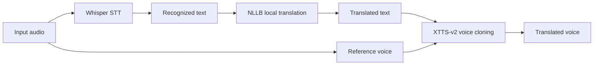

# Open Weight Speech Model Survey

과제 요구사항은 한국어 포함 다국어 STT, 로컬 번역, voice cloning TTS를 Kaggle Notebook과 Gradio에서 실행하는 것입니다. 제출 안정성을 우선해 실제 데모는 Whisper, NLLB, XTTS-v2 조합으로 구성했습니다.

## Selected Stack

### STT: Whisper large-v3-turbo with faster-whisper

- OpenAI Whisper 계열의 오픈 weight STT 모델입니다.
- 한국어를 포함한 99개 이상 언어의 음성 인식을 지원합니다.
- `faster-whisper`는 CTranslate2 기반이라 일반 Whisper보다 메모리와 속도 면에서 Kaggle GPU에 유리합니다.
- `large-v3-turbo`가 환경에서 바로 로드되지 않는 경우 `turbo` 별칭으로 자동 fallback하도록 구현했습니다.

### Translation: NLLB-200 distilled 600M

- Meta의 `facebook/nllb-200-distilled-600M` 모델을 사용합니다.
- 한국어와 200개 언어급 다국어 번역을 지원합니다.
- 외부 번역 API 호출 없이 Hugging Face Transformers로 로컬 추론합니다.
- 600M distilled 모델이라 Kaggle T4 GPU에서도 비교적 실행 가능성이 높습니다.

### Voice Cloning TTS: XTTS-v2

- Coqui의 `tts_models/multilingual/multi-dataset/xtts_v2`를 사용합니다.
- 한국어, 영어, 일본어, 중국어, 스페인어, 프랑스어, 독일어 등 17개 언어를 지원합니다.
- 짧은 참조 음성으로 cross-lingual voice cloning TTS를 수행할 수 있습니다.
- 과제는 교육 목적 데모이므로 CPML 라이선스 제한을 README와 코드 사용 범위에서 고려했습니다.

## Latest Alternatives

### OmniVoice

- 2026년 공개된 대규모 다국어 zero-shot TTS 모델입니다.
- 600개 이상 언어와 voice cloning을 지원합니다.
- Apache-2.0 라이선스와 Gradio demo를 제공하는 점이 장점입니다.
- 다만 Kaggle에서 의존성, 모델 크기, 다운로드 시간이 제출 안정성에 영향을 줄 수 있어 이번 구현의 기본 모델로는 선택하지 않았습니다.

### CosyVoice 3

- 한국어, 영어, 일본어, 중국어, 독일어, 스페인어, 프랑스어, 이탈리아어, 러시아어 등 9개 언어와 cross-lingual voice cloning을 지원합니다.
- Apache-2.0 라이선스이며 음질과 화자 유사도 측면에서 최신성이 좋습니다.
- 설치 절차와 런타임 의존성이 XTTS-v2보다 복잡할 수 있어 제출용 기본 스택에서는 제외했습니다.

### Raon-Speech

- KRAFTON에서 공개한 영어/한국어 중심 SpeechLM입니다.
- STT, TTS, SpeechChat 등 한국어 음성 처리에 강점이 있습니다.
- 과제 요구사항은 5개 이상 외국어 선택이므로 다국어 범위가 더 넓은 Whisper, NLLB, XTTS-v2 조합이 더 적합합니다.

## Supported Demo Languages

| Display | Whisper | NLLB | XTTS-v2 |
| --- | --- | --- | --- |
| Korean | `ko` | `kor_Hang` | `ko` |
| English | `en` | `eng_Latn` | `en` |
| Japanese | `ja` | `jpn_Jpan` | `ja` |
| Chinese | `zh` | `zho_Hans` | `zh-cn` |
| Spanish | `es` | `spa_Latn` | `es` |
| French | `fr` | `fra_Latn` | `fr` |
| German | `de` | `deu_Latn` | `de` |

## Architecture

